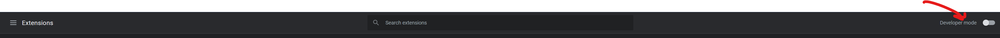
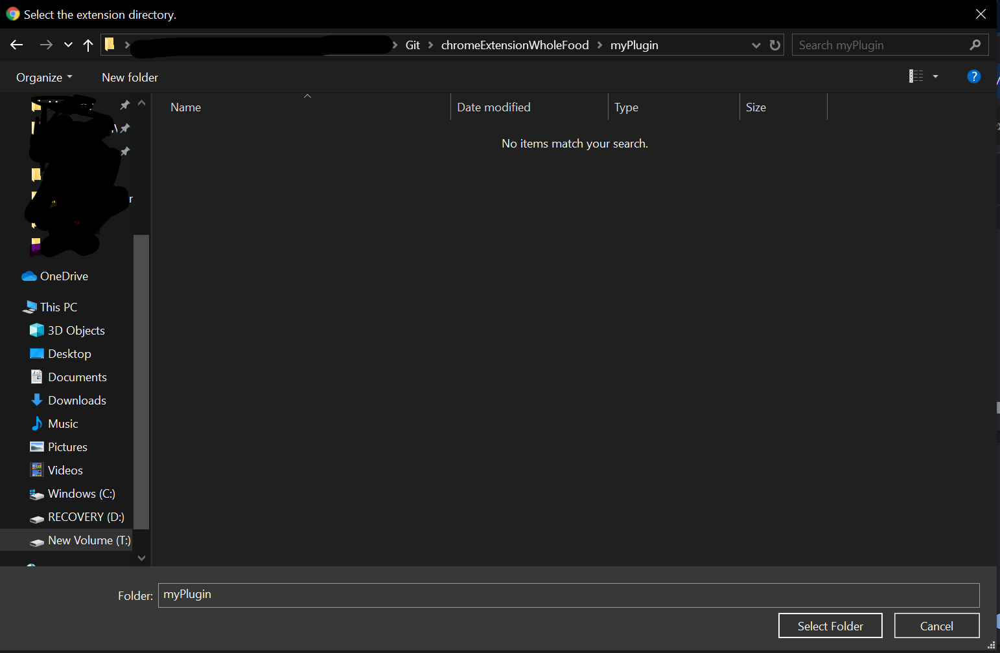

# Chrome Extension WholeFood
Whole Food Store Pick Up Notification on Chrome Browser

**Instructions**
>Download the two files from myPlugin folder: manifestcontent.js and manifest.js  and place in a new folder and follow the below steps:
```
1.type chrome://extensions/ in chrome Browser
```

```
2.enable developer mode by toggling on right hand side in chrome extension
```

```
3.Click on Load unpacked
```

```
4.Select your folder where these two files are present
```

```
5.Reload and enable the extension
```


```
6.Go to page amazon Schedule your Order Page
```


If slots are unavailable, it will reload the page after 1 minute to check continuosly.

It would alarm you in every minute when the slots are avaliable.
